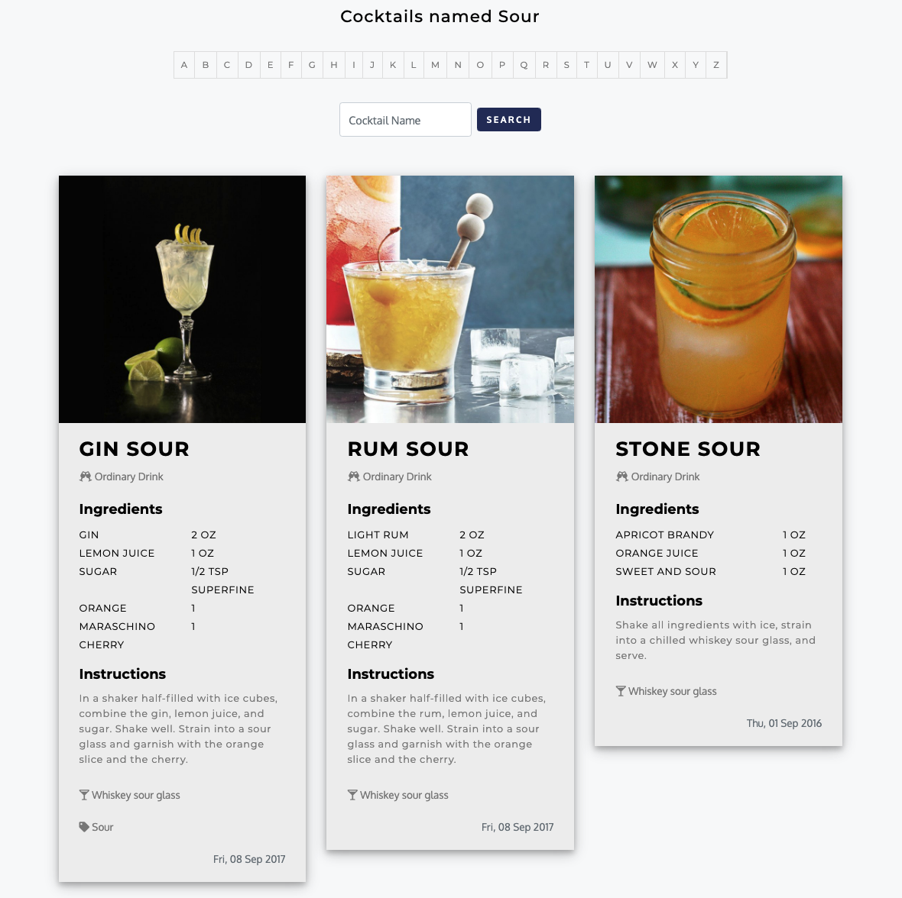

# The Cocktail DB API

This Jahia jContent V8 module is designed to retrieve Cocktails from the CocktailDB API 
(https://www.thecocktaildb.com/api.php)
---
### API KEY
You need to add to your jahia.properties the API key that you'll get from https://www.patreon.com/thedatadb
By default the module is configured using their development api key.
com.jahia.cocktaildb.apiKeyValue=<YOUR_API_KEY>

### Module functionment
The cocktail DB component works by itself, you can navigate by letter, ingredient and search, all from the front-end.

